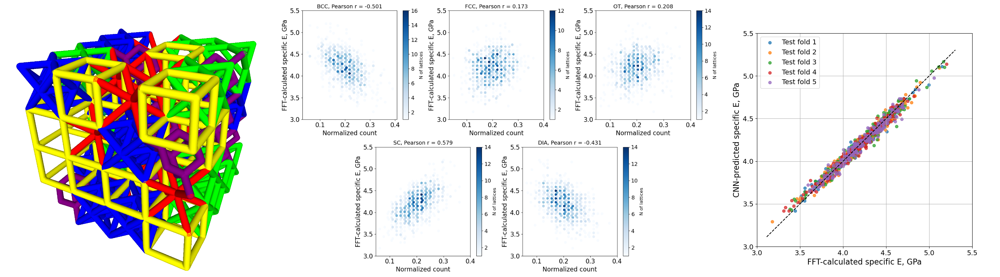

# 3D-CNN for Specific Elastic Modulus Prediction



This repository contains the code for the paper:

*Does high entropy improve elastic properties of 3D lattice materials?—A genetic algorithm and active learning study*

by S. Zorkaltsev, J. Segurado, M.T. Pérez-Prado and M. Haranczyk

[Comput. Mater. Sci., vol. 262, p. 114332, 2026.](https://doi.org/10.1016/j.commatsci.2025.114332)

## Scope

This repository provides the surrogate 3D-CNN model used to guide the optimization in the active learning loop. The optimization loop itself uses an FFT solver to calculate the elastic modulus values, as the values move beyond the training range of the model. The FFT solver is licensed to our collaborators and not included here, it is free for research purposes under a separate agreement (contact [Javier Segurado](mailto:javier.segurado@imdea.org))

For a related, runnable optimization pipeline that uses the same
kind of surrogate model to guide a genetic algorithm without requiring the
FFT tool - check [ga-bayesian-opt](https://github.com/sergei-zor/ga-bayesian-opt).

## Repository overview
 
- `unit_cells/` - .stl meshes used to generate lattices
- `initial_population/` - 1,000 4×4×4 matrices encoding the cell types
- `binary_matrices/` - 50 examples of pre-generated training structures for the smoke test
- `.github/workflows/` - a GitHub Actions workflow to perform smoke test
- `gen_train_matrices.py` - generates the training data (voxelized lattice structures, as in `binary_matrices/`)  
- `train_model.py` - trains 3D CNN model with k-fold cross-validation
- `DenseNet3D.py` - contains the model architecture definitions 

## Dataset generation

The training dataset consists of 1,000 lattice structures, each composed of a 4×4×4 arrangement of unit cells. Five unit cell topologies:

- Body-Centered Cubic (BCC)
- Face-Centered Cubic (FCC)
- Octet Truss (OT)
- Simple Cubic (SC)
- Diamond (DIA)

All unit cells have the same ligament diameter.  
Each lattice composition is defined by a corresponding `.npy` matrix specifying the unit cell type at each of the 64 lattice positions.

To generate the voxelized training data, run:

```
python gen_train_matrices.py

```

## Model training
The target values of FFT-calculated specific elastic modulus are provided in a separate array.
To train the model, run the following command, adjusting the hyperparameters as needed:

```
python train_model.py --batch_size 10 --n_epochs 100 --n_folds 5

```
The smoke test runs the full training on a small provided dataset to verify correct installation.

```
python train_model.py --smoke_test

```

## Citation

If you use part of the paper/code, please consider citing:

```
@article{ZORKALTSEV2026114332,
title = {Does high entropy improve elastic properties of 3D lattice materials?—A genetic algorithm and active learning study},
journal = {Computational Materials Science},
volume = {262},
pages = {114332},
year = {2026},
issn = {0927-0256},
doi = {https://doi.org/10.1016/j.commatsci.2025.114332},
url = {https://www.sciencedirect.com/science/article/pii/S0927025625006755},
author = {Sergei Zorkaltsev and Javier Segurado and María Teresa Pérez-Prado and Maciej Haranczyk},
keywords = {Genetic algorithm, Optimization, Structure-property relationship, Convolutional neural networks}}
```